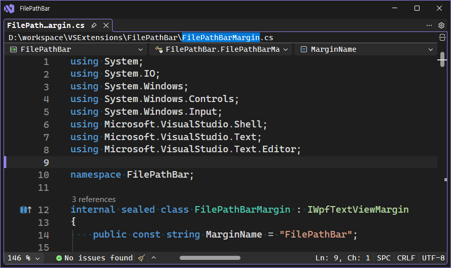

# FilePathBar

FilePathBar is a Visual Studio extension that shows the full path of the active file directly in the editor surface. It is designed for quick path inspection and copying without opening file properties or navigating through Solution Explorer.



## Features

- Shows the current file path in a selectable editor margin.
- Supports mouse selection and `Ctrl+C` for copying all or part of the path.
- Adds a right-click `Copy Full Path` command.
- Uses Visual Studio theme resources for light, dark, and high-contrast themes.
- Supports Visual Studio 2022 and Visual Studio 2026 through the VSIX manifest range `[17.0,19.0)`.

## Placement

The extension currently ships with the path bar at the top of the editor.

Placement is controlled at compile time in `FilePathBarPlacement.cs`:

```csharp
public const string Current = Top;
```

Change `Current` to `Bottom` to place the bar below the editor surface. A future version can replace this compile-time constant with persisted user options.

## Build

Build the extension from this repository root:

```powershell
dotnet build FilePathBar.slnx
```

The generated VSIX is written to:

```text
bin/Debug/net472/FilePathBar.vsix
```

## Development

Open `FilePathBar.slnx` in Visual Studio 2022 or Visual Studio 2026 with the Visual Studio extension development workload installed.

The project uses:

- `AsyncPackage` for package registration.
- `IWpfTextViewMarginProvider` for the editor margin.
- A read-only WPF `TextBox` for selectable path text.
